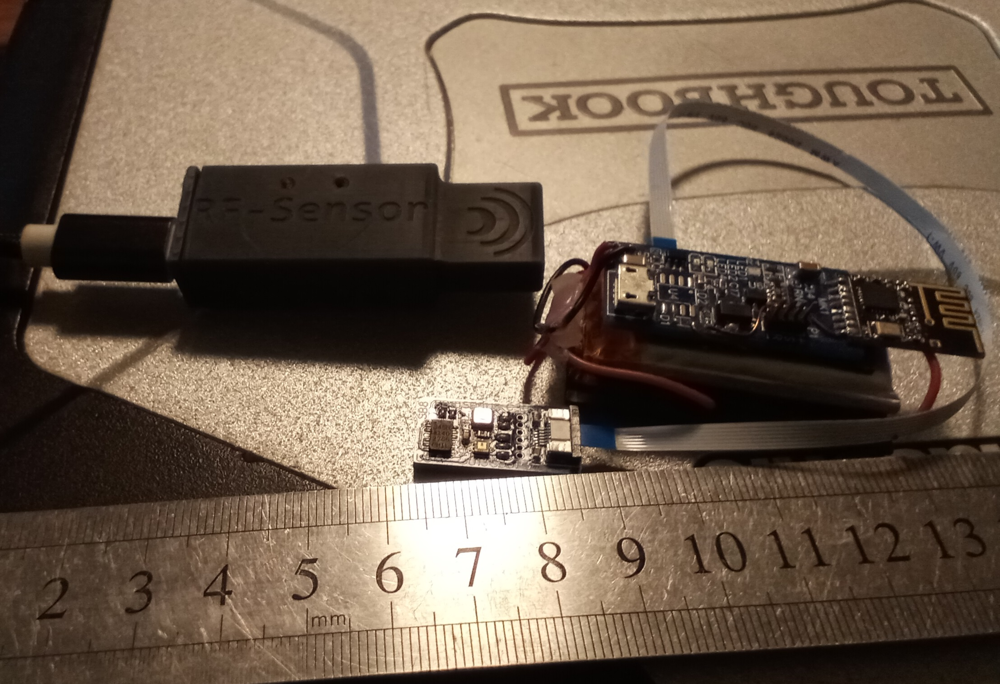
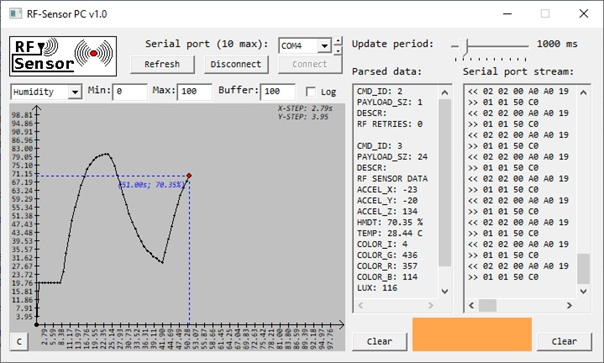
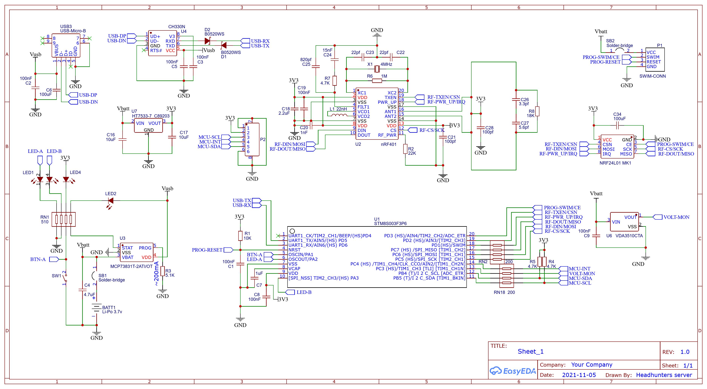
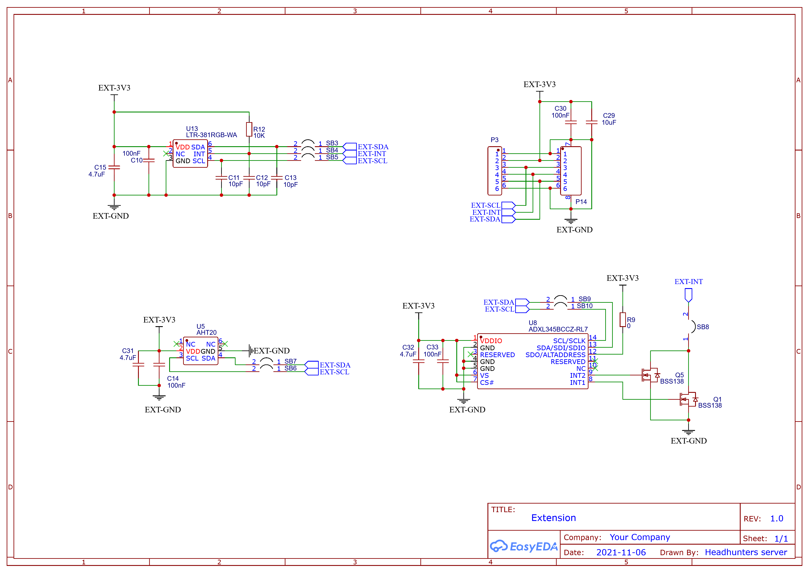
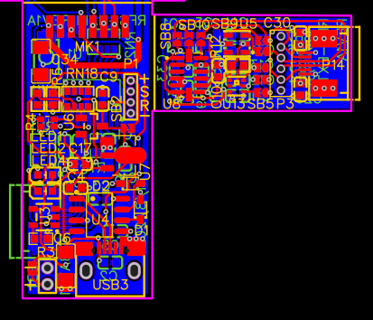

# RF-Sensor: Беспроводной мультисенсорный комплекс

**RF-Sensor** — это миниатюрный беспроводной модуль, разработанный с нуля в качестве вспомогательного инструмента для лабораторных исследований. Проект демонстрирует полный цикл создания встраиваемой системы: от идеи и схемотехники до прошивки микроконтроллеров, разработки ПО для ПК и 3D-печати функциональных корпусов.

Система состоит из двух частей: автономного сенсорного модуля с аккумулятором и USB-приемника, который подключается к ПК для сбора и визуализации данных в реальном времени.

## 🚀 Ключевые особенности

*   **Полный цикл разработки:** Весь проект — от 3D-модели и трассировки печатных плат до низкоуровневых драйверов и GUI для ПК — создан одним разработчиком.
*   **Беспроводная передача данных:** Связь между модулями осуществляется по радиоканалу 2.4 ГГц (nRF24L01+) на расстоянии до 5-10 метров, что позволяет проводить измерения дистанционно.
*   **Богатый набор сенсоров:** Устройство измеряет:
    *   **Температуру и влажность** (`AHT20`)
    *   **Ускорение** по трем осям (`ADXL345`)
    *   **Освещенность** (Lux) и **цветовой спектр** (RGB + IR) (`LTR-381`)
*   **Модульная конструкция:** Плата с сенсорами вынесена на гибкий FPC-шлейф с интерфейсом I2C, что позволяет размещать ее в самых труднодоступных местах и легко заменять или добавлять новые датчики.
*   **ПО для ПК с графическим интерфейсом:** Разработано нативное Windows-приложение (C, Win32 API) для:
    *   Отображения данных в реальном времени.
    *   Построения интерактивных графиков.
    *   Логирования данных в текстовый файл для последующего анализа (например, в Excel).
*   **Автономность и компактность:** Сенсорный модуль питается от Li-Po аккумулятора с солнечной батареей и имеет сверхнизкое энергопотребление в режиме сна, что обеспечивает длительную работу без подзарядки.
*   **Низкоуровневая прошивка:** Большинство драйверов для периферии (I2C, SPI) написаны вручную (bit-bang) на основе технической документации (datasheets) на компоненты.

## 🛠️ Технические характеристики и компоненты

### Сенсорный модуль (Передатчик)
*   **Микроконтроллер:** `STM8S003F3P6` (STMicroelectronics)
*   **Радиомодуль:** `nRF24L01+`
*   **Сенсоры:**
    *   `AHT20`: Температура и влажность
    *   `ADXL345`: 3-осевой акселерометр
    *   `LTR-381RGB-WA`: Датчик освещенности и цвета (RGB)
*   **Питание:** Li-Po аккумулятор 3.7В с контроллером заряда `MCP73831T`.

### Приемный модуль (USB-донгл)
*   **Микроконтроллер:** `STM8S003F3P6` (STMicroelectronics)
*   **Радиомодуль:** `nRF24L01+`
*   **Интерфейс:** USB, реализован через мост USB-UART `CH330N`.
*   **Корпус:** Разработан в САПР и напечатан на SLA 3D-принтере, по габаритам и форме повторяет обычную USB-флешку.

## ⚙️ Процесс разработки

### 1. Проектирование электроники

Схемы и двухслойные печатные платы были спроектированы в среде **EasyEDA**. Особое внимание уделялось миниатюризации и разделению аналоговых и цифровых цепей для снижения помех.

**Принципиальная схема основного модуля:**

**Принципиальная схема модуля с датчиками:**

**Топология печатной платы:**

### 2. Сборка и пайка

Прототипы собирались вручную. Для монтажа SMD-компонентов использовался термофен. Проект потребовал навыков прецизионной пайки, в частности, для установки датчика освещенности и цвета **LTR-381RGB** в корпусе **ChipLED** (2x2мм), который не имеет внешних выводов.

### 3. Прошивка

Прошивка для обоих микроконтроллеров написана на чистом **C** в среде **ST Visual Develop (STVD)** с использованием стандартных библиотек периферии STM8.

*   **Сенсорный узел (`/src_sens`):**
    *   Реализованы программные (bit-bang) драйверы для интерфейсов **I2C** и **SPI**.
    *   Написаны библиотеки для работы со всеми сенсорами на основе их даташитов.
    *   Реализован простой кооперативный планировщик задач для управления опросом датчиков и отправкой данных.
    *   Для экономии энергии используется режим глубокого сна (`halt()`) с пробуждением по таймеру.

*   **Приемный узел (`/src_host`):**
    *   Работает как мост RF-to-UART.
    *   Реализует простой бинарный протокол для обмена данными с ПК, включающий команды и проверку целостности данных (CRC16).

*   **Радиообмен:**
    *   Для работы с модулем `nRF24L01+` была адаптирована легковесная open-source библиотека, что демонстрирует навык интеграции стороннего кода в bare-metal проекты.

### 4. Программное обеспечение для ПК

Десктопное приложение написано на чистом **C** с использованием **Win32 API**. Это позволило создать легкое и быстрое нативное приложение без внешних зависимостей.

*   **Работа с COM-портом:** Асинхронное чтение и запись данных.
*   **Парсинг протокола:** Разбор входящих бинарных пакетов от приемника.
*   **Визуализация:** Данные с сенсоров выводятся в текстовом виде и на интерактивном графике. Модуль для отрисовки графиков (`mygraph.c`) также написан с нуля.
*   **Логирование:** Возможность записи всех поступающих данных в `.txt` файл с временными метками для дальнейшего анализа.

## 📂 Структура проекта

*   **/src_sens/**: Исходный код прошивки для автономного сенсорного модуля (передатчика).
*   **/src_host/**: Исходный код прошивки для USB-приемника (хоста).
*   **/src_pc/**: Исходный код приложения для ПК на Win32 API.
*   **/3d/**: 3D-модели корпусов.
*   **/img/**: Изображения, схемы.

## License
This project is licensed under the [CC BY-NC-ND 4.0](https://creativecommons.org/licenses/by-nc-nd/4.0/) license.
